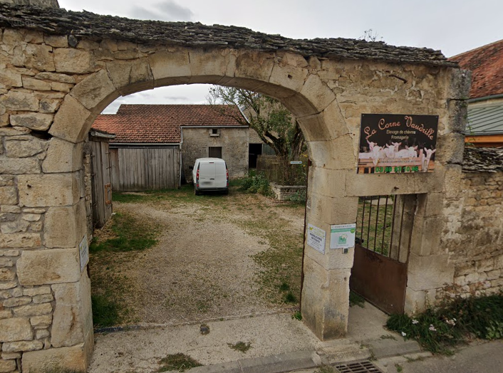

Title: Stage à La Corne Vaudrille
Date: 2023-05-30 18:00
Category: Expériences professionnelles

La Corne Vaudrille est une chèvrerie à Savoisy (21594) en Bourgogne-Franche-Compté. J'ai pu y faire 6 semaines de stage en tout (1 en novembre 2017 de mon propre chef, 1 en février 2019 dans le cadre scolaire, 4 en juin 2022 dans le cadre scolaire)  
 
J'ai pu faire la traite, nettoyer les locaux, curer les chèvres, participer à la création de fromages, accueilli les clients, entretenir le pré des chèvres.

Lien vers leur site : <a href="https://lacornevaudrille.fr">https://lacornevaudrille.fr</a>

<!-- Dossier qui contiendra toutes les photos prises durant les différentes sessions. -->