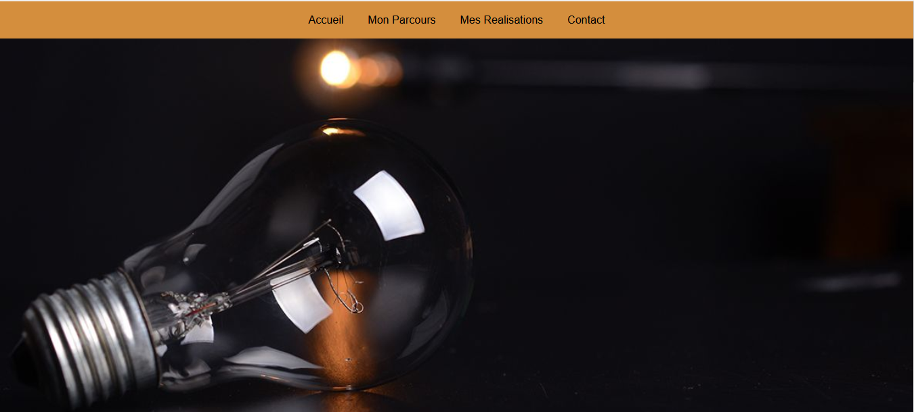
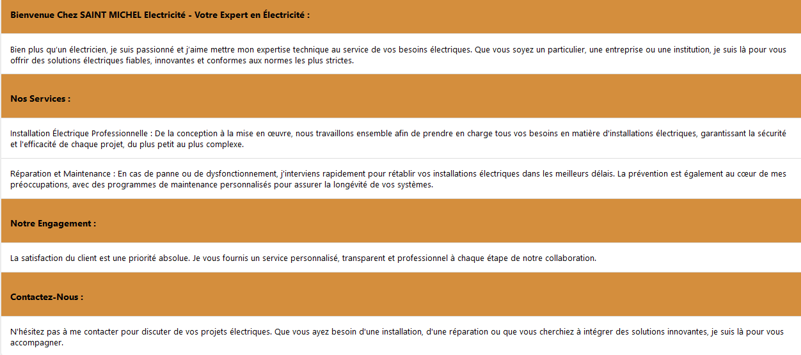
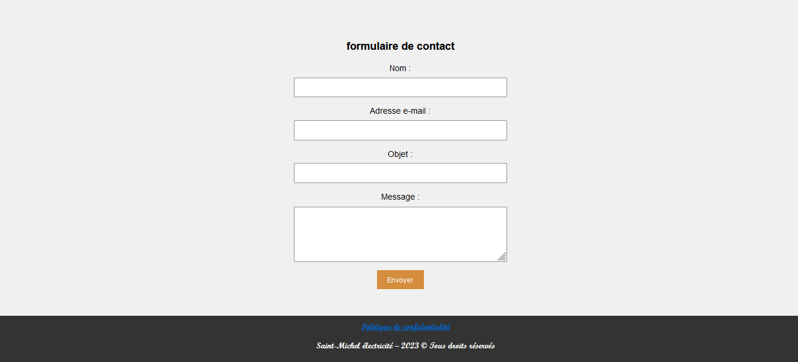

Title: Stage chez Saint-Michel électricité
Date: 2023-05-30 18:00
Category: Expériences professionnelles

Création d'un site web pour un électricien situé à Yèbles
7 semaines de stages du 11/12/2023 au 09/02/2024

Site réalisé entièrement manuellement en PHP HTML/CSS. Malheureusement je n'ai jamais été recontacté donc pour tout finaliser mettre le site en ligne donc celui-ci n'est pas hébergé et a des problèmes encore non résolus. Cependant voici ce à quoi il ressemble: 
  
  
Mon camarade et moi même avons du créer un moyen pour les clients de contacter notre maitre de stage. Nous avions tout d'abord pensé à mettre un formulaire qui enregistre les données dans une base de données. Cependant j'ai eu l'idée de ne pas utiliser de bases de données mais d'envoyer un mail directement pour plus de sécurité et de practicité. Par conséquent, j'ai appris à utiliser PHPMailer ainsi que SendGrid pour ce procéder. Ainsi lorsqu'un utilisateur remplis ce formulaire,  
  
un mail est envoyé et le propriétaire de l'adresse mail peut le consulter