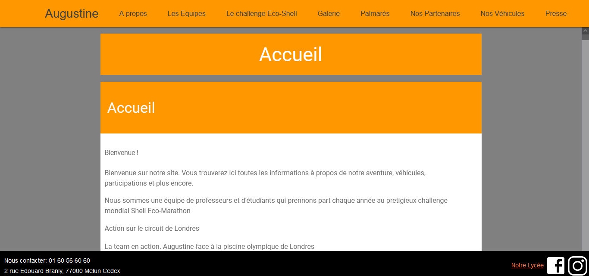

Title: Stage à Tournesol
Date: 2023-05-30 18:00
Category: Expériences professionnelles

Réalisation d'un site web pour l'association Tournesol du lycée Léonard de Vinci à Melun. J'ai pu faire 6 semaines de stages du 22/05/2023 au 30/06/2023

Ce site a été réalisé grâce au générateur de site statique GetPelican, et au template Materialistic-Pelican qui a subit beaucoup de changements (retrait d'un onglet qui était sur le coté gauche, ajout d'un footer, modification dans le CSS, etc...), en HTML/CSS et en python.  
 
Il a pour objectif de présenter la voiture Augustine IV qui succède à Augustine III et qui est une voiture construite par des étudiants du lycée et qui fonctionne entièrement à l'énergie solaire. Celle-ci est candidate au Shell éco-marathon.

J'ai du prendre en main l'outil GetPelican et le template materialistic-pelican, apprendre le fonctionnement, régler toutes les problématiques liées à son statut de générateur de site, modifier le template, créer plusieurs chartes graphique, etc...

Lien vers le site (il s'agit d'une version du site sans tout le contenu car la version complète n'a pas encore été publiée): <a href="https://titouanvanrompaey.github.io/augustine/">https://titouanvanrompaey.github.io/augustine/</a>
