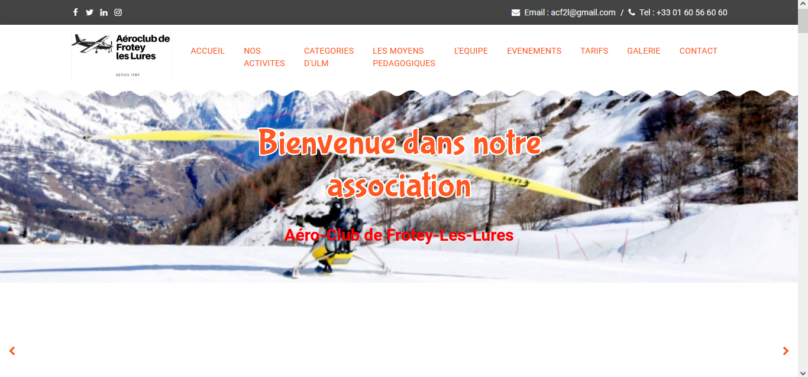
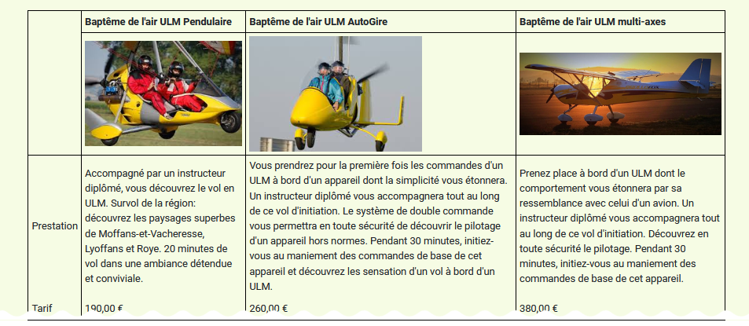
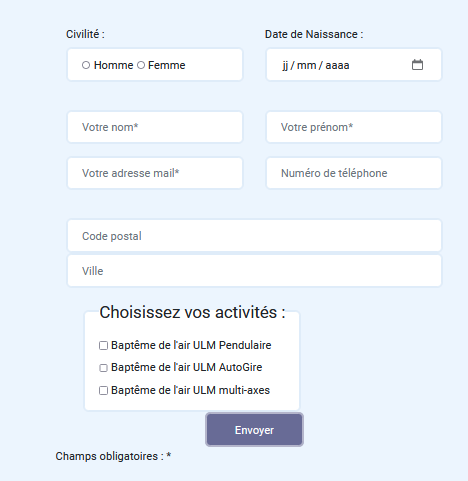
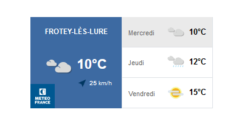
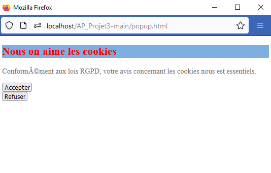

Title: Projet n°1: ACF2L
Date: 2023-05-30 18:00
Category: Ma formation

Nous avions un template de site déjà fait ayant pour sujet un faux service de location d'ULM situé à Frotey-lès-Lures.

Par groupe de 4 nous avons du modifier le template et insérer de nouvelles fonctionnalités comme:

- Créer un tableau avec les tarifs.
  
- Un formulaire d'inscription lié à une base de données.
  
- Une API qui indique la météo.
  
- Un pop-up pour demander d'accepter les cookies.
  

Langages utilisés: 
Langages utilisés: 

