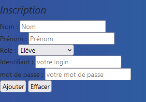

Title: Projet n°2: Geoworld
Date: 2023-05-30 18:00
Category: Ma formation

Nous avions une base de données référançant tout les pays du mondes et un site qui affichait les données d'un continent. 

Par groupe de 2 nous devions modifier le site afin de:

- Modifier la direction artistique du site
  
- Pouvoir modifier le continent que l'on souhaite afficher.
  
- Créer plusieurs rôles (élève, professeur, administrateur) ayant tous différents droits et forcer l'utilisateur à se connecter et garder la session ouverte sur tout le site
  
- Ajouter la possibilité de mettre à jour la base de données seulement pour les professeurs et les administrateurs.
  
- Ajouter la possibilité d'ajouter un utilisateur pour l'administrateur
  
- Ajouter une fonctionnalité de notre choix. Avec mon binôme nous avons choisi d'installer un système de chat
  
Langages utilisés: 

