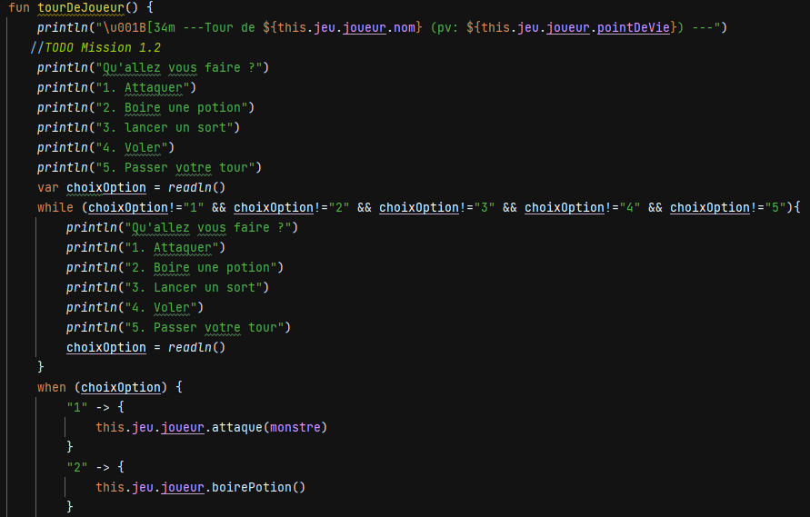
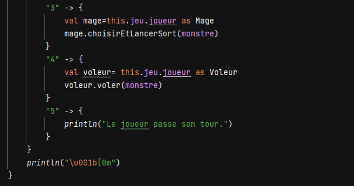
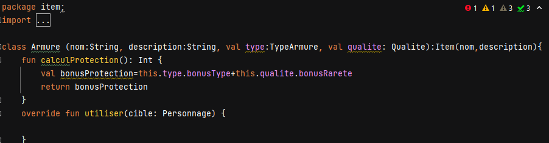
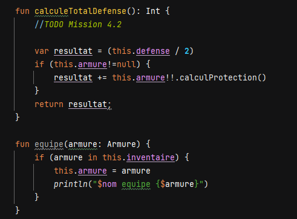
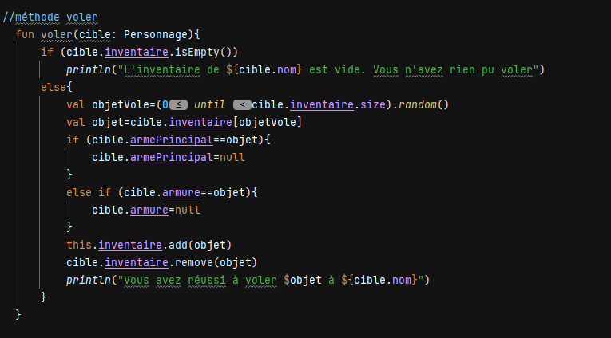

Title: Projet n°4: Kotlin Adventure
Date: 2023-05-30 18:00
Category: Ma formation

L'objectif de ce projet était de créer un jeu vidéo de type RPG avec Kotlin. Par groupe de 3 nousnous étions répartis différentes taches pour ma part, j'ai réalisé les taches suivantes:

- Créer la fonction tourDeJoueur() qui permet de faire jouer le joueur en lui laissant choisir entre plusieurs options puis je l'ai complété au fil du temps avec de nouvelles options
  
  
- Créer le système d'armures du personnage en créant la classe Armure et TypeArmure ainsi que la fonction qui permet de calculer les dégats réduits en fonction de l'armure portée avec l'option pour équiper une armure ou une arme  
  
  
- Créer un système de classes avec les classes Guerrier, Mage, Voleur
- Créer un sort exclusif à la classe voleur
  
J'ai également pu aider mon un de mes camarades dans la création des objets bombes et potion, et la création de classes exclusives au Mage

Langage utilisé: 