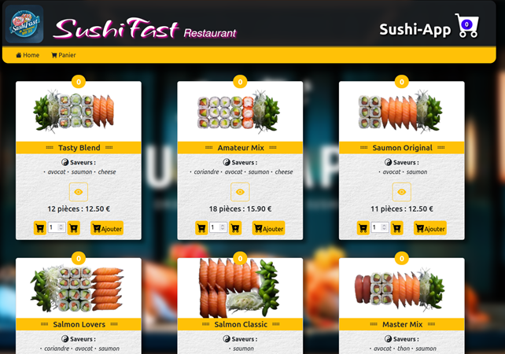
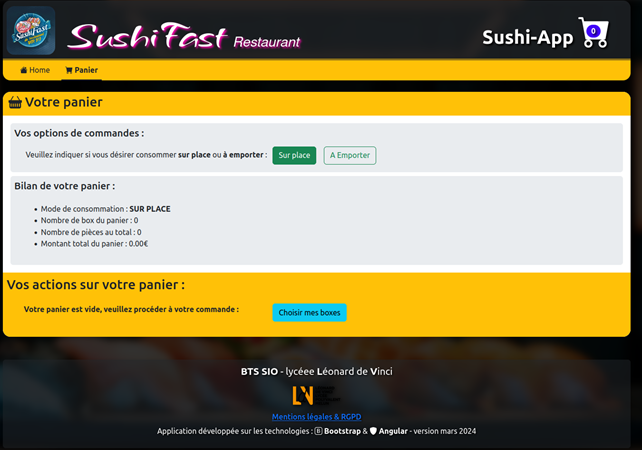
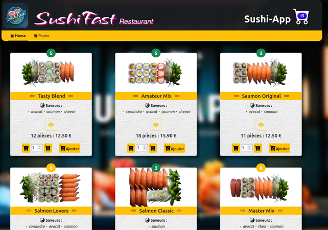
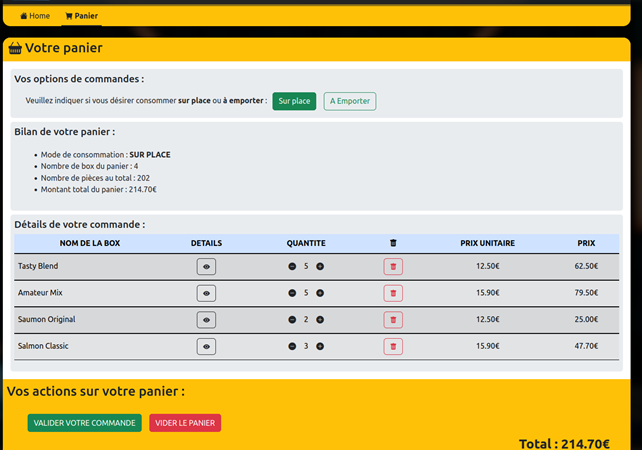

Title: Projet n°5: Sushi app
Date: 2023-05-30 18:00
Category: Ma formation

Nous avions pour consigne de créer un site qui puisse permettre de commander des sushis. Pour ce faire nous avions à notre disposition un fichier Json et nous devions faire une API pour:

- Afficher les données grâce à celui-ci et consulter les détails de la box de sushi.
  
- Faire une page pouvant afficher le panier et le récapitulatif de commande.
  
- Pouvoir passer commande directement sur le site en sélectionnant le nombre de sushis que nous souhaitons
  
- Faire en sorte que le récapitulatif de commande s'affiche bel et bien
  

Nous n'avons évidemment pas ajouté la page de paiement pour ne pas vous dérober de l'argent ;).

Langages utilisés: 

