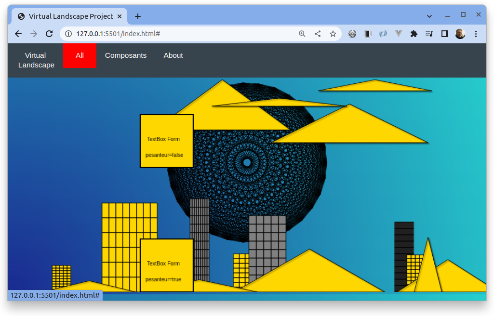

Title: Projet n°3: Virtual Landscape
Date: 2023-05-30 18:00
Category: Ma formation

Nous avions pour consigne de créer un site qui génère un paysage à partir d'éléments générés plus ou moins aléatoirement. Par groupe de 2 nous avions du modifier les éléments pour:

- Créer un nouveau paysage différent de celui de base. 
  
- Pour ce faire nous avions créé de nouveaux éléments comme un nuage.
  
Mon camarade et moi avions pour projet de créer un paysage inspiré du vieux Londres. Cependant nous avons surrévalués nos capacités et très mal géré notre temps. Par conséquent nous avons malheureusement un résultat défaillant qui ne remplit pas les attentes des professeurs mais surtout de nous même.
  
Langages utilisés: 

